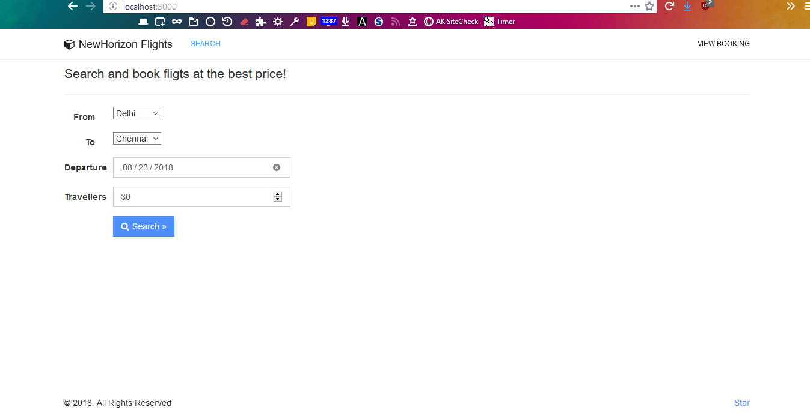
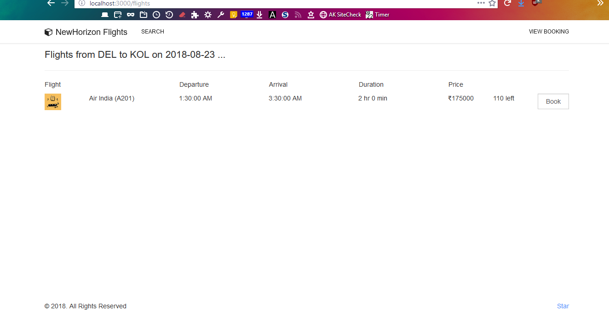
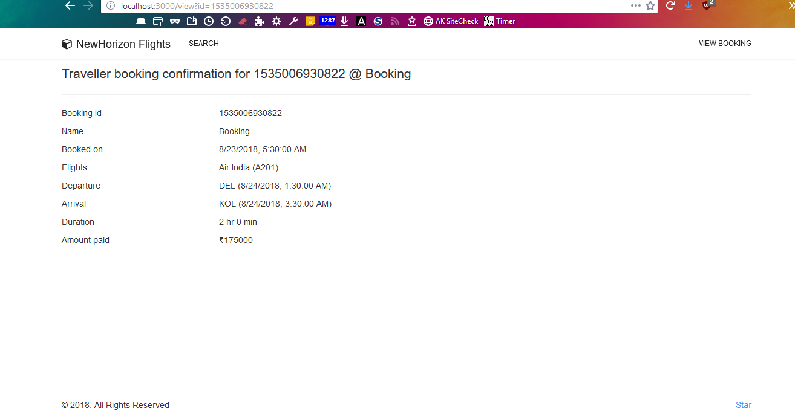
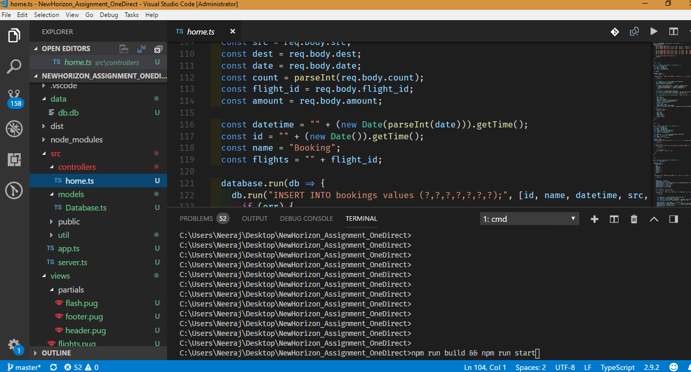

# NewHorizon_Assignment_OneDirect by @Code0987

# Building and running

- Install [Node.js](https://nodejs.org/en/)

```
cd <project_folder>
npm install
npm run build
npm run start
```

# Screenshots




